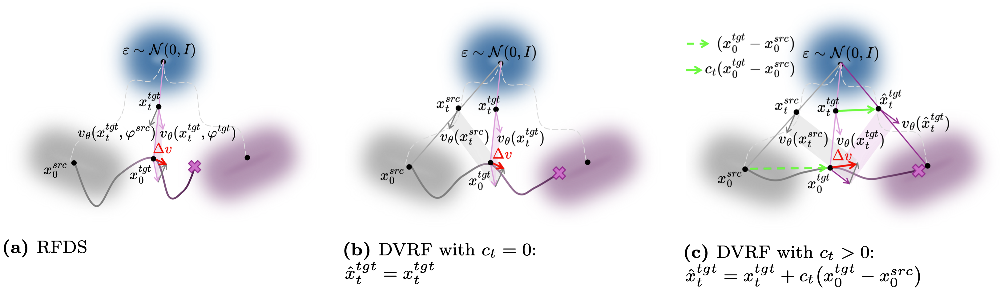
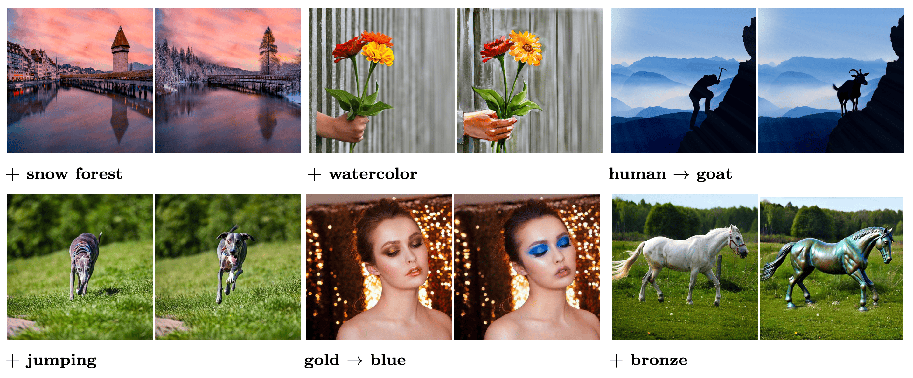
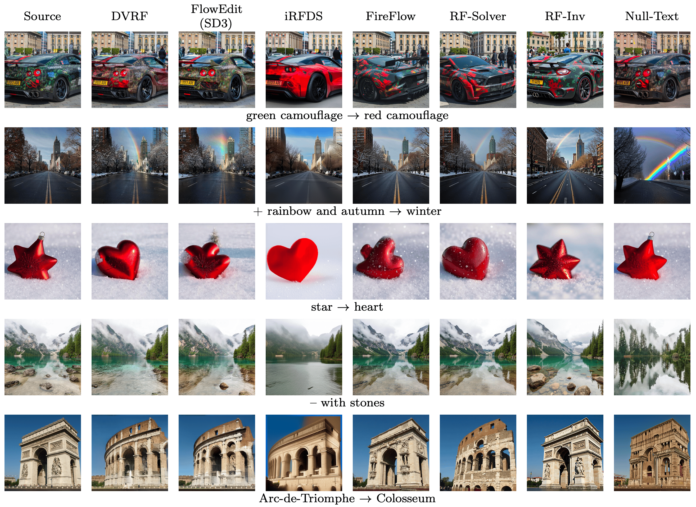

## Delta Velocity Rectified Flow (DVRF)

Official implementation of the paper: "Delta Velocity Rectified Flow for Text-to-Image Editing".  
ArXiv: [add link here]

### Overview
DVRF is a text-guided image editing method that optimizes the latent of a pre-trained diffusion model (SD3 / SD3.5) using a rectified-flow objective on the delta of predicted velocities between a source and a target prompt. It provides high-fidelity, localized edits while preserving the structure of the source image.

- **Models**: Stable Diffusion 3 (SD3), Stable Diffusion 3.5 (`medium`, `large`, `large-turbo`)
- **Pipelines**: Diffusers pipelines (Hugging Face)
- **Input**: Source image + source prompt + target prompt(s)
- **Output**: Edited image and optimization trajectory frames

---

### Method

The DVRF objective optimizes the latent by aligning the target velocity with the source velocity while introducing a progressively increasing coupling term. See the method schematic:



---

### Results

Selected qualitative results demonstrating localized edits and structure preservation:



Additional comparisons:




---

### Installation

Clone the repo:
```bash
git clone https://github.com/gaspardbd/DeltaVelocityRectifiedFlow.git
cd DeltaVelocityRectifiedFlow
```

Create the conda environment :
```bash
conda env create -f dvrf_environment.yml
conda activate dvrf_env
```


---

### Quick Start

1) Configure your experiment in `exp.yaml`:
```yaml
- exp_name: "DVRF_SD3"
  dataset_yaml: images/mapping_file.yaml
  model_type: "SD3"        # or "SD3.5", "SD3.5-medium", "SD3.5-large", "SD3.5-large-turbo"
  T_steps: 50               # diffusion timesteps
  B: 1                      # batch size for averaging the gradient
  src_guidance_scale: 6
  tgt_guidance_scale: 16.5
  num_steps: 50             # optimization steps
  seed: 41
  eta: 1.0                  # progressive c_t = k/T * t  described in the paper
  scheduler_strategy: "descending"   # "random" or "descending"
  lr: "custom"             # or a float, e.g. 0.02
  optimizer: "SGD"         # SGD, Adam, AdamW, RMSprop, SGD_Nesterov
```

2) Prepare `images/mapping_file.yaml` with your images and prompts:
```yaml
- input_img: images/a_cat_sitting_on_a_table.png
  source_prompt: A cat sitting on a table.
  target_prompts:
    - A lion sitting on a table.
```

3) Run editing:
```bash
python edit.py --exp_yaml exp.yaml
```

Outputs are saved under `outputs/<exp_name>/<model_type>/src_<image_name>/tgt_<index>/` including the side-by-side image and trajectory frames.

---

### Citation
If you use this code, please cite our paper:
```bibtex
@article{beaudouin2025dvrf,
  title={Delta Velocity Rectified Flow for Text-to-Image Editing},
  author={Gaspard Beaudouin, Minghan Li, Jaeyeon Kim, Sunghoon Yoon, Mengyu Wang},
  journal={arXiv preprint arXiv:xxxx.xxxxx},
  year={2025}
}
```

---

### License
http://creativecommons.org/licenses/by/4.0/

---

### Acknowledgements
- Built on top of Hugging Face Diffusers pipelines and Stable Diffusion 3/3.5.
- Thanks to the research community for open-source models and tooling.